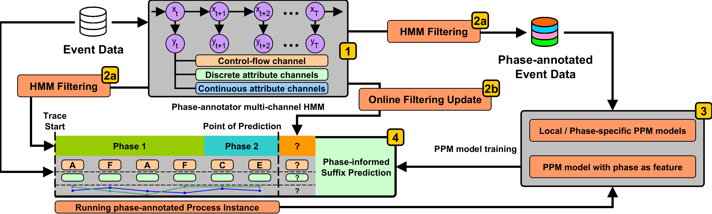

# Process Phase Segmentation with Mixed-Type Hidden Markov Models for Training Local Predictive Process Monitoring Models

This is the implementation accompanying the paper 'Process Phase Segmentation with Mixed-Type Hidden Markov Models for Training Local Predictive Process Monitoring Models' submitted to the ICPM Conference 2027

The HMM specification referenced in the paper (footnote 3) is available in `HMM_spec.md`.
The set of PPM parameters by model referenced in the paper (footnote 6) is available under `PPM_params.md`.

## Framework

We provide a hybrid framework built on a process phase identification by multi-channel and mixed-type Hidden Markov Models (HMMs) implemented in `pyro` [[R1]](#R1) with subsequent integration of identified phases into various models of the field of predictive process monitoring (PPM). PPM models implemented for evaluation of the complete pipeline are BEST [[R2]](#R2), Most-probable path search (as previously performed by [[R3]](#R3)), Classification and Regression Trees (CART) [[R4]](#R4) and an LSTM network (adapted from [[R5]](#R5) and extended).

## Setup

We implemented our approach as a python module performing HMM learning via `pyro` and provide various scripts to reproduce our experimental results.
To setup the environment for running our code, we provide a `pyproject.toml` file (requires python>=3.12) from which the needed dependencies can be gathered with `pip` via (execute from the project directory):

`python -m pip install .`

or with [`poetry`](https://python-poetry.org/) via (execute from the project directory):

`poetry install`

## Usage

The codebase consists of our module `hmm4ppm`, different scripts for dataset manipulation (`BPI2012_conversions.py`), event log metric extraction (`log_characteristics.py`) and scripts for training the HMM models with subsequent integration of the phases into the PPM prediction pipeline (`hmm4ppm_prediction.py').

Model configurations are provided in different files with model-specific parameters. The existing config files are `general_config.yml`, `model_configs.yml`, `data_configs.yml`.

### Config

The general config sets the parameters for the main prediction loop. You can specify the datasets you want to analyze (`dataset` either as list of multiple or string of a single dataset), the evaluation strategy (i.e., cross-validation with `cv_folds` > 1 or single split with `cv_folds`==1 alongside the desired 'train_pct' specifying the share of cases you want to use for training) and the model configuration (`model_config`). For multiprocessing you can set the number of cores you want to use for the evaluation (`ncores`).

The general config file is linked to the remaining config files. With `dataset` you access the different data configurations matched by the dataset name. The data config file specifies the dataset filename (`file_name`), the relevant column identifiers (`case_identifier`, `activity_identifier`, `timestamp_identifier`) as well as the information incorporated into the event clustering by specification of the respective preprocessing and scaling options (`transform_params` and `encoding_params`). The entries inside `encoding_params` need to be distinct across the given options of `OneHotEncoder`, `OrdinalEncoder`, `StandardScaler`, `ZeroInflatedGammaScaler`, `MinMaxScaler` and `RobustScaler`.

The model config file holds the model-specific parameters for model training.

### Phase-Informed Suffix Prediction with HMM4PPM

We provide multiple scripts for a complete recreation of our experimental pipeline presented in the paper. Script `src/hmm_training.py` performs the HMM model training for a given set of parameters (we provide an existing best parameter setting for HMM training for each dataset in dataset-specific files (`best_params_wasserstein.jsonl`); the best parameter search can also be performed via comparison of the achieved Wasserstein metrics after HMM training with script `src/hmm_best_params.py`). 
The identified HMMs can be used for subsequent PPM model training and prediction with script `src/phase_informed_predictions.py`, where PPM models are executed with different parameter combinations for phase-informed models and their phase-agnostic counterparts and are subsequently evaluated on Next Activity Prediction and Activity Suffix Prediction with accuracy and suffix similarity metrics. We recommend to alter the model configuration in the `model_configs.yml` or to use model configuration `test_config` with desired parameter settings for testing of the pipeline as the full experimental evaluation performs training and predictions for an exhaustive set of parameter combinations.

## Included Event Log Datasets

- We provide the analyzed datasets in the `data/` folder:
	- `Helpdesk.csv` [[D1]](#D1)
	- `BPI2012.csv` [[D2]](#D2) 
	- `BPI2013_closed.csv` [[D3]](#D3)
	- `BPI2013_incidents.csv` [[D4]](#D4)
	- `env_permit.csv` [[D5]](#D5)
	- `sepsis.csv` [[D6]](#D6)
- Script (`src/BPI2012_conversions.py`) performs data manipulation of the BPI Challenge 2012 event log and creates further logs:
	- `BPI2012_Full.csv`: BPI Challenge 2012 with an augmented activity identifier consisting of the raw activity names and the lifecycle information (SCHEDULE, START, COMPLETE)
	- `BPI2012_W.csv`: A subset of the `BPI2012_Full.csv` where we only consider the workflow information, i.e., activities with the `W_` prefix
	- `BPI2012_C.csv`: A subset of the `BPI2012.csv` where we only consider the activities with `COMPLETE` lifecycle information
	- `BPI2012_WC.csv`: A subset of the `BPI2012_C.csv` where we only consider the workflow information, i.e., activities with the `W_` prefix
	- In our work, we provide analyses on the logs `BPI2012_W.csv`, `BPI2012_C.csv` and `BPI2012_WC.csv`

## References

<a id="R1">[R1]</a> Eli Bingham, Jonathan P. Chen, Martin Jankowiak, Fritz Obermeyer, Neeraj Pradhan, Theofanis Karaletsos, Rohit Singh, Paul Szerlip, Paul Horsfall,and Noah D. Goodman. 2018. Pyro: Deep Universal Probabilistic Programming. doi:10.48550/ARXIV.1810.09538

<a id="R2">[R2]</a> Simon Rauch, Christian M. M. Frey, Andrea Maldonado, Daniel Schuster, Gabriel Tavares, and Thomas Seidl. 2026. Hierarchical structuring of bilaterally expanding subtrace patterns for efficient tree-based activity suffix prediction. Process Science 3, 1 (2026). doi:10.1007/s44311-026-00050-y

<a id="R3">[R3]</a> Sjoerd van der Spoel, Maurice van Keulen, and Chintan Amrit. 2013. Process Prediction in Noisy Data Sets: A Case Study in a Dutch Hospital. Springer, Berlin, Heidelberg, 60–83. doi:10.1007/978-3-642-40919-6_4

<a id="R4">[R4]</a> Leo Breiman, Jerome H. Friedman, Richard A. Olshen, and Charles J. Stone. 2017. Classification And Regression Trees. Routledge. doi:10.1201/9781315139470

<a id="R5">[R5]</a> Manuel Camargo, Marlon Dumas, and Oscar González-Rojas. 2019. Learning Accurate LSTM Models of Business Processes. Springer International Publishing, 286–302. doi:10.1007/978-3-030-26619-6_19

## Dataset References

<a id="D1">[D1]</a> Polato, Mirko (2017). Dataset belonging to the help desk log of an Italian Company (Link: <https://data.4tu.nl/articles/_/12675977/1>)

<a id="D2">[D2]</a> van Dongen,  Boudewijn (2012). BPI Challenge 2012 (Link: <https://data.4tu.nl/articles/_/12689204/1>)

<a id="D3">[D3]</a> Steeman, Ward (2013). BPI Challenge 2013, closed problems (Link: <https://data.4tu.nl/articles/_/12714476/1>)

<a id="D4">[D4]</a> Steeman, Ward (2013). BPI Challenge 2013, incidents  (Link: <https://data.4tu.nl/articles/_/12693914/1>)

<a id="D5">[D5]</a> Buijs, Joos (2022). Receipt phase of an environmental permit application process (WABO),  CoSeLoG project (Link: <https://data.4tu.nl/articles/_/12709127/2>)

<a id="D6">[D6]</a> Mannhardt,  Felix (2016). Sepsis Cases - Event Log (Link: <https://data.4tu.nl/articles/_/12707639/1>)
